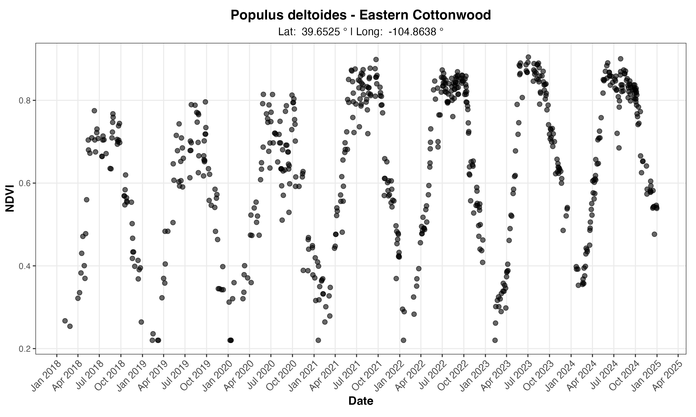
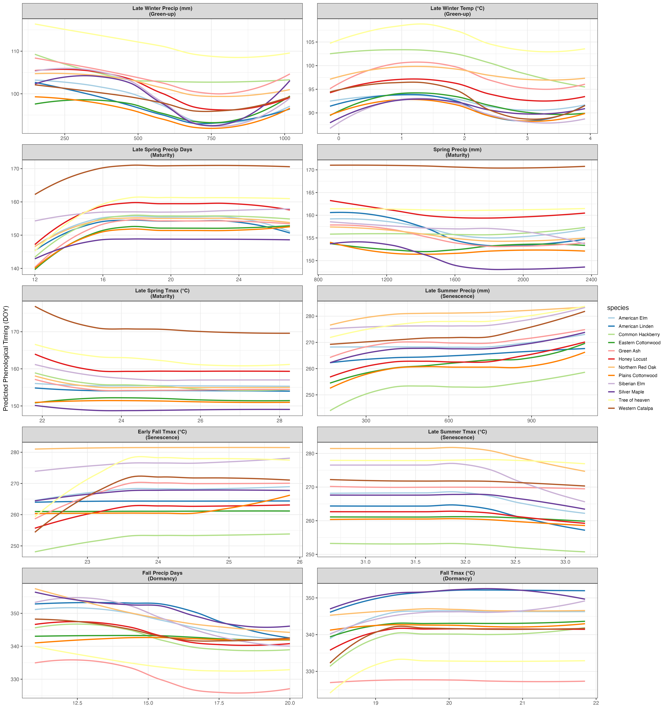

## Abstract

Urban trees provide critical cooling benefits in cities, but their effectiveness depends on phenological timing—the seasonal cycle beginning with leaf emergence and ending in dormancy. A deeper understanding of how tree phenology responds to temperature and precipitation drivers is essential for climate-adaptation planning. To that end, this study leverages near-daily PlanetScope satellite observations (2018-2024), climate data, and land-cover mapping to investigate the phenological responses of 12 common deciduous tree species in Denver, Colorado. We extracted four phenological stage dates (greenup, maturity, senescence, dormancy) for 3,450 individual trees using automated curve-fitting methods, then modeled phenological timing against seasonal climate variables—precipitation and temperature—and land-cover characteristics using XGBoost, a machine learning method. Our analysis found that the effect of temperature and precipitation climate variables was mixed, depending on phenological stage. Specifically, the timing of a tree's maturity, senescence, and dormancy was strongly associated with temperature and precipitation, while the timing of a tree's greenup showed relatively weaker associations to those climate variables. To predict phenological timing, statistical models primarily used precipitation data as the climate variable, while temperature data was used as a secondary variable. Partial dependence analysis revealed important non-linear responses, including a 32°C threshold where heat stress begins to influence senescence timing. Land-cover characteristics showed modest effects on phenology, with impervious surfaces, counterintuitively, delaying rather than advancing timing. This may indicate that moisture limitations are overriding the urban heat island thermal effects in semi-arid urban tree phenology. Our modeling of the observed warming of +0.8°C in Denver over the past 30 years found that growing seasons were extended by an average of 8.2 days, driven primarily by delayed dormancy timing. Tree species showed diverse responses to warming temperatures, with highly plastic species (Tree of Heaven, Western Catalpa, Common Hackberry) extending growing seasons by 15-16 days, while inflexible species (cottonwoods, Northern Red Oak) showed minimal changes. These findings have important implications for urban-forest management and ecosystem-service provision as climate change advances.

## 1. Introduction

Urban trees are effective natural mitigators of the urban heat island (UHI) effect. Studies have demonstrated that neighborhoods with mature tree canopy cover experience measurably cooler microclimates compared to areas with limited canopy [@Ziter_2019; @Alonzo_2021]. As global temperatures continue to rise, the effects of UHIs are expected to intensify [@STONE2012]. Given the increasingly critical role of urban forests in climate-resilience strategies, it is essential to understand the drivers of urban tree phenology—the seasonal cycle beginning with leaf emergence and ending in dormancy—and how these patterns may shift as environmental conditions change.

The timing and duration of phenological stages are strongly influenced by climate variables, particularly temperature and precipitation. Research has shown that elevated temperatures caused by climate change can lengthen vegetation growing seasons with higher spring temperatures typically accelerate greening up (leaf emergence), while warmer fall temperatures delay senescence (onset of foliage color change), extending the period of active growth and canopy cover [@RICHARDSON2013; @ZHOU2016; @Piao2019]. This extended canopy period can enhance the cooling benefits of urban trees by increasing shade and evapotranspiration, helping to mitigate the urban heat island effect. However, these benefits are not be guaranteed: some studies have shown that warmer winters can delay leaf-out and reduce the expected benefits of extended growing seasons, particularly in species that leaf out early in spring [@Chamberlan_2021; @Fu2019]. Precipitation patterns add another layer of complexity. In the fall, low precipitation or drought stress can trigger earlier leaf senescence, shortening the period of active growth and reducing canopy cover [@Wu2022; @Ji_2025]. Critically, the interaction of temperature and precipitation determines ultimate outcomes, underscoring the complex challenges that climate change poses for urban tree health and their role in mitigating urban heat.

The body of research on urban phenology has used two methods to monitor continent- to citywide phenological trends: satellite remote-sensing platforms, such as MODIS or Landsat [@BOLTON2020; @Crawford_2024], and in-situ observations that provide high temporal but low spatial resolution data from on-the-ground cameras [@Richardson2018; @HUFKENS2019]. To circumvent the limitations of satellite remote-sensing, some researchers have combined in-situ data to verify or calibrate satellite remote-sensing observations [@ZHANG2018; @TIAN2021]. High-resolution satellite constellations, such as PlanetScope, have recently emerged as a valuable datasource, combining the spatial precision needed to monitor the location of individually identified trees with the temporal frequency required to monitor phenological changes on an almost daily basis [@Moon2021; @ALONZO2023; @dixon2025]. Researchers can now study vegetation across large urban areas in unprecedented detail and scale.

### 1.1 Objectives

This study leverages near-daily PlanetScope NDVI observations of urban trees in Denver, Colorado; daily temperature and precipitation data from 2018 to 2024; and land-cover data to investigate how urban-tree phenology responds to environmental drivers and how these responses may shift under future climate scenarios. Specifically, this research addresses three key questions:

1.  Does temperature or precipitation have a greater influence on the timing of greenup, maturity, senescence, and dormancy for 12 common urban tree species in Denver? And are these responses fairly uniform across species?
2.  How does land cover—specifically impervious surfaces and irrigated landscapes—affect tree phenology?
3.  How have/will different tree species respond to moderate climate change scenarios?

### 1.2 Study Area

Located in the mid-latitudes, Denver, Colorado, experiences distinct seasonal patterns that produce clear phenological transitions across all four stages (greenup, maturity, senescence, and dormancy). The city maintains a detailed public tree inventory representing hundreds of species, and detailed land-cover mapping enables analysis of how urban infrastructure affects these phenological patterns.

As the planet warms, Denver is projected to confront both increased temperatures and precipitation uncertainty—conditions that will directly affect the timing of leaf-out, canopy development, and senescence for this urban forest. According to Colorado State University's Colorado Climate Center's most recent "Climate Change in Colorado" report, by mid-century, Denver is projected to see temperatures rise between 1.4°C and 3.1°C, compared to the 1971–2000 baseline. The city has already warmed by approximately 0.8°C over the past 30 years, with the most pronounced increases occurring during summer and fall. Under moderate carbon-emissions scenarios, Denver's climate will, by 2050, resemble that of Pueblo, Colorado, today, whereas higher emissions scenarios could make it feel more like Albuquerque, New Mexico, by mid-century. [@Bolinger2023].

Summer and fall are expected to warm slightly more than winter and spring, with summer temperatures increasing by 2.2–3.3°C and winter by 1.7–2.2°C. This warming is projected to drive dramatic increases in extreme heat events: by 2050, Denver could experience an average of seven days per year exceeding 37.8°C (100°F) and roughly 35 days above 35°C (95°F), compared to very few such days historically. In essence, the typical year in 2050 may be as warm as the hottest years on record today [@Bolinger2023].

Future precipitation patterns for Denver remain uncertain. Climate models (CMIP5 and CMIP6, under RCP 4.5 scenarios) disagree on whether precipitation will increase or decrease, with projections ranging from -7% to +7% by 2050. Even with potential increase in precipitation, warmer temperatures may offset any benefits by pulling more moisture out of the soils and melting snowpack, reducing water availability for trees [@Bolinger2023].

The study period of this paper (2018 to 2024), includes years with temperatures and precipitation both above and below the 1971-2000 baseline. Notably, 2024 was Denver's third-warmest year on record, with temperatures 1.8°C above baseline—approaching mid-century projections—while 2019 and 2020 were notably drier than the baseline. This climate variability enables us to model how Denver's urban trees respond to average conditions projected for 2050. [@NOAA_GHCN_daily].

## 2. Methods & Materials

This study models individual tree phenological metrics against corresponding land-cover characteristics and seasonal climate variables using machine-learning methods. We combined near-daily PlanetScope NDVI observations from 2018-2024 with Denver's municipal tree inventory, daily climate records, and high-resolution land-cover data to create a comprehensive dataset linking individual tree phenology to environmental drivers. XGBoost models were fit separately for each species and phenological stage (greenup, maturity, senescence, dormancy) to quantify climate and land-cover effects.

### 2.1 Materials

#### 2.1.1 Denver Tree Inventory and Tree Sample Selection

The City and County of Denver's "Tree Inventory Denver" is a publicly available urban forestry database containing detailed records for approximately 300,000 trees across Denver County. The inventory includes species identification, tree size measurements, health assessments (disease and pest observations), and precise GPS coordinates for each tree. This comprehensive dataset allowed us to link individual trees in the inventory to their corresponding locations in satellite imagery, enabling remote-sensing analysis [@tree_inventory_denver].

Our analysis focused exclusively on trees within Denver County boundaries west of longitude -104.7302°. This spatial filter excluded outlier trees that, while technically within county boundaries, exist in radically different environments, such as prairie grasslands near Denver International Airport.

From this spatially filtered inventory, we implemented a three-part sampling approach to select trees suitable for satellite-based remote sensing phenology analysis. First, we restricted the sample to mature trees with diameters of 24 inches or greater, as larger trees have crown sizes more readily detectable in moderate-resolution satellite imagery. Second, we selected 15 species based on their abundance in the Denver urban forest, ensuring adequate sample sizes for species-specific modeling. Third, we prioritized species diversity by including in our sample deciduous and coniferous species; species from multiple genera with intra-genus variation (e.g., Eastern Cottonwood and Plains Cottonwood); and a mix of native, non-native, and invasive species to capture variation in climate sensitivity and adaptation.

An interactive Shiny application was developed to facilitate sample selection and quality control, allowing visual inspection of candidate trees' spatial distribution across Denver County \[[github](https://github.com/jm1212a/denver_tree_phenology/tree/main/denver_trees_app)\]. The final sample consisted of 23,779 individual trees from 15 species across 11 genera. The sample included 11 native species, 2 non-native species, and 2 invasive species (@tbl-species). The sample data set can be found here along with the corresponding cleaning code \[[github](https://github.com/jm1212a/denver_tree_phenology/blob/main/data_raw/denver_tree/denver_trees_sample.geojson)\].

| Scientific Name | Common Name | Genus | Observations | Status | Leaf Type |
|------------|------------|------------|------------|------------|------------|
| *Acer saccharinum* | Silver Maple | *Acer* | 6,217 | Native | Deciduous |
| *Ailanthus altissima* | Tree of Heaven | *Ailanthus* | 426 | Invasive | Deciduous |
| *Catalpa speciosa* | Western Catalpa | *Catalpa* | 656 | Native | Deciduous |
| *Celtis occidentalis* | Common Hackberry | *Celtis* | 656 | Native | Deciduous |
| *Fraxinus pennsylvanica* | Green Ash | *Fraxinus* | 2,369 | Native | Deciduous |
| *Gleditsia triacanthos* | Honey Locust | *Gleditsia* | 2,642 | Native | Deciduous |
| *Pinus nigra* | Austrian Pine | *Pinus* | 957 | Non-native | Conifer |
| *Pinus ponderosa* | Ponderosa Pine | *Pinus* | 521 | Native | Conifer |
| *Populus deltoides* | Eastern Cottonwood | *Populus* | 871 | Native | Deciduous |
| *Populus sargentii* | Plains Cottonwood | *Populus* | 1,070 | Native | Deciduous |
| *Quercus rubra* | Northern Red Oak | *Quercus* | 481 | Native | Deciduous |
| *Tilia americana* | American Linden | *Tilia* | 655 | Native | Deciduous |
| *Tilia cordata* | Littleleaf Linden | *Tilia* | 405 | Non-native | Deciduous |
| *Ulmus americana* | American Elm | *Ulmus* | 2,794 | Native | Deciduous |
| *Ulmus pumila* | Siberian Elm | *Ulmus* | 2,919 | Invasive | Deciduous |

: Summary of selected tree species with sample sizes and ecological characteristics {#tbl-species}

#### 2.1.2 Remotely Sensed NDVI Data

The Normalized Difference Vegetation Index (NDVI) is a widely used spectral index that measures vegetation greenness by comparing the difference between near-infrared (strongly reflected by vegetation) and red light (absorbed by vegetation). This relationship emerges from plant physiology: chlorophyll in leaves strongly absorbs red light for photosynthesis, while the cellular structure of healthy leaves strongly reflects near-infrared radiation. The index ranges from -1 to +1, with higher values indicating greater photosynthetic activity and canopy density. For phenological applications specifically, NDVI provides a continuous, objective measurement of canopy greenness that directly reflects the seasonal cycles of greenup, maturity, senescence, and dormancy. [@Rouse1974; @Tucker1979]

The study's NDVI observations were obtained from PlanetScope's imagery in the red (590-682 nm) and near-infrared (780-888 nm) bands [@Planet2025]. The PlanetScope imagery was then processed using the methodology and code used in @ALONZO2023. The multiple fine-resolution images captured each day were mosaicked together to create continuous spatial coverage over Denver County. Quality assessment layers provided by PlanetScope were used to mask clouds, snow, and haze, automatically detecting atmospheric interference that would compromise NDVI accuracy. NDVI was calculated for each masked image using the standard formula:

$$NDVI = (NIR - Red) / (NIR + Red)$$

Tree-level NDVI values were extracted by overlaying tree locations from the Denver inventory with NDVI imagery. To capture canopy pixels rather than understory, each tree-date was filtered to retain only the top 25% of NDVI values within the buffer, reducing contamination from grass, pavement, or other non-target features while maintaining sufficient sample size. These daily observations were compiled into NDVI time series for each tree spanning 2018-2024, creating a multi-year record of vegetation greenness dynamics at the individual tree level, which served as the foundation for phenological curve fitting and metric extraction (@fig-ndvi-time-series).

{#fig-ndvi-time-series fig-align="center"}

#### 2.1.3 Extracted Phenological Metrics

Phenological metrics were extracted from the raw NDVI time series using the `phenofit` package in R [@Kong2022; @phenofit], which implements multiple curve-fitting methods and automated quality-control procedures for vegetation phenology analysis. Similar to other studies using PlanetScope images, the Raw NDVI values were first despiked to remove anomalous observations caused by residual cloud contamination, sensor noise, or atmospheric interference [@dixon2025]. For this analysis, we used a median-based despike filter with a 3-point window and 5 standard deviation threshold from the `oce` package [@Kelley2024].

Individual growing seasons were identified from the NDVI time series using the `season_mov()` function with weighted Whittaker (wWHIT) smoothing [@eilers2003; @KONG2019]. To improve the accuracy of growing season detection, particularly for trees exhibiting multi-year growth trends, NDVI time series were detrended using a linear model regressing NDVI against time; however, the original NDVI were used to fit the phonological curve. While growing seasons generally corresponded to calendar years, the algorithm occasionally detected seasons spanning year boundaries, particularly for trees with extended dormancy periods. For each detected growing season, we fitted phenological curves using the double-logistic Elmore function [@elmore2011], which models vegetation greenness as

$$f(t) = mn + (mx - m_7 * t) \left[\frac{1}{1 + e^{(m_3'-t )/m_4'}} - \frac{1}{1 + e^{(m_5' -t)/m_6'}}\right]$$

where $mn$ and $mx$ are the minimum and maximum NDVI values, $t$ is time, $(m_3', m_5')$ are the start date of the gowning season (SOS) and end of growing season (EOS), respectively, $(m_4', m_6')$ the slope of spring greening up or autumn senescence onset, and $m_7$ is the rate of greening down in the summer.

After testing multiple types of curves, the Elmore curve was selected because it consistently produced the most reliable fits across species and provided biologically interpretable parameters.

{#phenological-curve fig-align="center" width="564"}

Curve-fit quality was assessed using adjusted R², with trees retained in the final sample only if they met two criteria: (1) mean R² ≥ 0.90 across all fitted growing seasons, and (2) at least six growing seasons successfully detected over the seven-year study period. These conservative thresholds ensured high-quality phenological curves while excluding trees with poor NDVI signal. Four phenological stage dates were extracted from each annual curve using the inflection point method [@ZHANG2003], which identifies the dates of maximum rate-of-change in the NDVI trajectory: (1) Green-up, the spring inflection point marking the beginning of leaf emergence, (2) Maturity, the date at which canopy development has reached a leveling-off point in the spring, (3) Senescence, the fall inflection point marking the start of leaf-loss, and (4) Dormancy, the date when a tree has lost its leaves and NDVI begins to level off for the winter. Inflection points were chosen over alternative methods (e.g., threshold-based or derivative-based) because they provide consistent timing estimates across species with different canopy densities.

All extracted metrics, fitted-curve parameters, goodness-of-fit statistics, and curve metadata were saved for each tree-year observation. A custom R function was developed to facilitate visualization of annual curves with overlaid phenological metrics, available at \[[github](https://github.com/jm1212a/denver_tree_phenology/blob/main/R/plot_year.R)\]. After quality filtering, 3,450 trees across 12 species remained from the initial sample of 23,779 trees, providing 24,150 tree-year observations across the 2018-2024 study period \[[github](https://github.com/jm1212a/denver_tree_phenology/tree/main/data)\]. The distribution of tree species in the final dataset is shown in . The final dataset consisted entirely of deciduous species, as coniferous trees did not pass the quality-filtering checks.

```{r}

#| label: tbl-final-sample
#| tbl-cap: "Final Sample of Tree by Species"
#| echo: false
#| column: margin

library(kableExtra)

tibble::tribble(
  ~Species, ~`Leaf Persistence`, ~Observations,
  "Silver Maple", "Deciduous", 952,
  "Green Ash", "Deciduous", 495,
  "Honey Locust", "Deciduous", 343,
  "Siberian Elm", "Deciduous", 328,
  "American Elm", "Deciduous", 313,
  "Eastern Cottonwood", "Deciduous", 248,
  "Common Hackberry", "Deciduous", 237,
  "Plains Cottonwood", "Deciduous", 230,
  "Tree of heaven", "Deciduous", 92,
  "Northern Red Oak", "Deciduous", 86,
  "American Linden", "Deciduous", 83,
  "Western Catalpa", "Deciduous", 60,
  "Total", "", 3467
) %>%
  knitr::kable(
    format = "latex",
    booktabs = TRUE,
    align = c("l", "l", "r"),
    format.args = list(big.mark = ",")
  ) %>%
  kable_styling()

```

#### 2.1.4 Climate Data

Daily climate observations were obtained from the National Oceanic and Atmospheric Administration (NOAA) Global Historical Climatology Network-Daily (GHCN-Daily) database for station USW00023062, located within Denver Central Park (formerly Stapleton International Airport). This station was selected due to its central location within Denver County. Three core meteorological variables were extracted: maximum daily temperature (TMAX), minimum daily temperature (TMIN), and daily precipitation (PRCP). From these variables, daily mean temperature was calculated as the arithmetic mean of TMAX and TMIN [@NOAA_GHCN_daily].

Following a similar methodology to [@dixon2025], climate variables were aligned with the biological timing of phenological stages, daily observations were aggregated into seasonal summaries corresponding to key periods of tree development. Temperature metrics included both seasonal mean temperatures and seasonal mean maximum temperatures, capturing both average thermal conditions and peak daytime heat stress. Precipitation was summarized in two ways: seasonal totals (e.g., spring precipitation sum) to capture resource availability during active growth periods, and year-to-date cumulative totals. These seasonal windows were defined to capture climate conditions during biologically relevant periods preceding or coinciding with each phenological stage. For example, green-up timing was modeled using late winter and early spring climate (February-April), while senescence timing incorporated summer and early fall conditions (June-October).

The resulting climate dataset included 10 distinct seasonal periods (winter, late winter, spring, early spring, late spring, summer, late summer, fall, early fall, late fall) with corresponding temperature and precipitation metrics. This temporal structure was designed to maximize consistency across phenological stages while preserving sufficient climate variation to detect species-specific sensitivities to temperature versus precipitation drivers. @tbl-climate provides a complete breakdown of seasonal climate variables, their corresponding months, and which phenological were selected as predictors for modeling.

| Seasonal Period | Months | Climate Metrics | Rationale |
|------------------|------------------|------------------|------------------|
| Winter | Dec-Jan-Feb\* | Mean temp, Mean Tmax, Total precip, Precip days | Winter chilling requirements and moisture storage |
| Late Winter | Feb-Mar | Mean temp^G^, Mean Tmax^G^, Total precip^G^, Precip days^G^, YTD cumulative precip | Transition to spring; pre-green-up conditions |
| Spring | Mar-Apr-May | Mean temp, Mean Tmax, Total precip^M^, Precip days, YTD cumulative precip | Primary growing season onset |
| Early Spring | Mar-Apr | Mean temp, Mean Tmax, Total precip, Precip days, YTD cumulative precip | Critical leaf-out period |
| Late Spring | May-Jun | Mean temp^M^, Mean Tmax^M^, Total precip, Precip days^M^, YTD cumulative precip | Canopy development and peak growth |
| Summer | Jun-Jul-Aug | Mean temp, Mean Tmax, Total precip, Precip days, YTD cumulative precip | Peak growing season and heat stress |
| Late Summer | Jul-Aug | Mean temp, Mean Tmax, Total precip^S^, Precip days^S^, YTD cumulative precip | Transition to dormancy preparation |
| Fall | Sep-Oct-Nov | Mean temp, Mean Tmax^D^, Total precip, Precip days^D^, YTD cumulative precip^D^ | Leaf senescence period |
| Early Fall | Sep-Oct | Mean temp^S^, Mean Tmax^S^, Total precip, Precip days, YTD cumulative precip | Primary leaf color change and drop |
| Late Fall | Nov-Dec | Mean temp^D^, Mean Tmax, Total precip, Precip days, YTD cumulative precip | Final leaf drop and winter preparation |

: Climate Variable Definitions and Seasonal Aggregations {#tbl-climate}

^a^ December values assigned to following year to maintain biological relevance\
^b^ Used in Green-up models\
^c^ Used in Maturity models\
^d^ Used in Senescence models\
^e^ Used in Dormancy models

*Note:* All models also included land-cover variables (impervious surface, irrigated surface, unirrigated surface, tree canopy, and water at 90m buffer) which are detailed in Section 2.1.5.

#### 2.1.5 Land-Cover Data

Land cover characteristics surrounding each tree were derived from the City and County of Denver's high-resolution land-cover dataset which classifies the region into nine distinct land-cover categories: (1) structures, (2) impervious surfaces, (3) water, (4) grassland/prairie, (5) tree canopy, (6) irrigated lands/turf, (7) barren/rock, (8) cropland, and (9) shrubland/scrubland [@drcog_land_cover]. The fine spatial resolution of this dataset (1 meter resolution) allows for precise characterization of the immediate environment surrounding individual trees, capturing the heterogeneity of urban landscapes that influences tree microclimate and resource availability.

As in similar studies of land-cover effects on tree penology conducted in Washington, D.C. [@ALONZO2023], circular buffers of 90 meters were created around each tree's GPS coordinates. Within each buffer, the number of pixels belonging to each land-cover class was tallied and converted to percentages, representing the proportion of the surrounding landscape occupied by each cover type. Following methodology similar to [@Crawford_2024], the nine original land cover classes were consolidated into five ecologically meaningful categories to simplify interpretation and reduce model complexity (@tbl-lc). The 90-meter buffer land cover variables were used as predictors in all XGBoost models to account for local environmental context effects on phenological timing.

| Final Category      | Original Classes Included                    |
|---------------------|----------------------------------------------|
| Impervious Surface  | Structures, Impervious Surfaces, Barren/Rock |
| Irrigated Surface   | Cropland, Irrigated Lands/Turf               |
| Unirrigated Surface | Grassland/Prairie, Shrubland/Scrubland       |
| Tree Canopy         | Tree Canopy                                  |
| Water               | Water                                        |

: Land Cover Classification Consolidation {#tbl-lc}

### 2.2 Methodologies

#### 2.2.1 Pearson Correlation Analysis

Following the methodology established in [@dixon2025], a correlation analysis was conducted to assess the strength and direction of relationships between climate variables and phenological metrics across all 12 species. Pearson correlation coefficients between each phenological metric and its biologically relevant climate predictors were calculated. This approach allowed for the assessment the consistency of climate effects across species and the degree of species-specific variation in climate sensitivity. Results are visualized as a heatmap (@fig-cor-plot).

Analyses were conducted in R version 4.5.1 patchwork[@patchwork2025], ggtext [@ggtext]and tidyverse [@tidyverse2019] packages.

#### 2.2.2 Extreme Gradient Boosted Model

We used XGBoost (Extreme Gradient Boosting) to model the relationship between environmental predictors and phenological timing for each tree species. XGBoost is a machine-learning algorithm that builds a series of decision trees sequentially, where each new decision tree learns to correct the errors of previous ones. XGBoost makes no distributional assumptions about residuals and can automatically capture non-linear relationships and complex interactions between predictors. Individual models were fitted for all four of the phenological metrics for each of the 12 species (48 models in total).

Each model included two categories of features. First, we incorporated environmental predictors specific to each phonological stage, including three climate variables (seasonally relevant temperature mean, mean max temperature, and either year-to-date cumulative precipitation or cumulative percipitation within a given season) and land-cover variables (percent of impervious surfaces and percent of irrigated surfaces). Climate variables captured regional meteorological conditions and year-to-year variation, while land-cover variables represented local environmental context, including urban heat island effects. When both temperature and precipitation variables were included for a phenological stage, we also created an interaction term (temperature × precipitation) to allow the model to capture synergistic or antagonistic interactions between these climate variables.

Second, we included tree-specific features to account for repeated measures on individual trees, analogous to random effects in mixed models. These features included tree_mean_pheno (historical average phenology timing for each tree), tree_n_obs (number of observation years per tree), and UID_numeric (numeric tree identifier). These tree-specific features allow the model to capture consistent early or late timing in individual trees, while environmental predictors capture spatial and temporal variation.

We used conservative hyperparameters optimized for regularization and generalization. The series consisted of 500 decision trees (nrounds), with each decision tree having a maximum depth of 4 levels (max_depth) to prevent overfitting. The learning rate (eta) was set to 0.01, a relatively low value that requires more iterations but produces more stable and accurate models. To introduce beneficial randomness that improves generalization, we set the subsample to 0.7 (using 70% of observations for each tree) and colsample_bytree to 0.7 (using 70% of features for each tree). The objective function was set to reg:squarederror for squared error loss appropriate for continuous outcomes. These conservative parameters prioritize prediction accuracy and model stability over training speed.

To evaluate the model's performance 10-fold cross-validation was used. Data were randomly partitioned into 10 groups, with models iteratively trained on 90% of data and tested on the remaining 10%. Three cross-validated, performance metrics were then calculated: R², root mean squared error (RMSE, in days), and mean absolute error (MAE, in days). The average performance of all the species models by phenological stages can be found in (@tbl-species-summary).

RMSE values ranging from 5.9 to 12.9 days across all 48 species-stage combinations. These error magnitudes are approximately two to three times higher than RMSE values (2.1 to 4.9 days) reported by [@DAI2019] using gradient boosting for the prediction of tree phenology metrics (e.g., spring leaf-out). The significant difference could be attributed to differences in data sources used to derive the phenological metrics. [@DAI2019] modeled spring leaf-out dates from ground-based observations at individual species over a over several non-consecutive decades, instead of remote-sensing data collected over a seven-year period. Given the limitations of our data, we worked under the assumption that the species gradient-boosted models are with an exceptionable margin of error and effectively capture climate-phenology relationships.

| Phenological Stage | N Species | Total Obs. | Mean R² | Mean RMSE (days) | Mean MAE (days) |
|------------|------------|------------|------------|------------|------------|
| Maturity | 12 | 2,244 | 0.644 | 6.95 | 5.11 |
| Green-up | 12 | 2,194 | 0.644 | 8.29 | 6.32 |
| Senescence | 12 | 2,182 | 0.691 | 9.10 | 7.01 |
| Dormancy | 12 | 2,158 | 0.590 | 11.64 | 8.87 |

: XGBoost Model Performance by Phenological Stage {#tbl-species-summary}

A complete breakdown of performance across all 48 individual species-stage models, as well as a breakdown of the importance of each variable in the models can be found in appendix. The importance values represent the "gain" metric from XGBoost, which measures the average improvement in prediction accuracy that each climate variable contributes when used to split the data in the model's decision trees. Higher gain values indicate that a variable is more influential in determining phenological timing.

All analyses were conducted in R version 4.5.1 [@rcoreteam2024] using the XGBoost [@xgboost2025], caret [@caret2024], patchwork[@patchwork2025], and tidyverse [@tidyverse2019] packages.

#### 2.2.3 Linear Mixed Models: Comparison and Limitations

Initial attempts to model climate-phenology relationships using linear mixed-effects models (LMMs) were not successful. Diagnostic tests revealed severe assumption violations across 97% of models (69/72). Only 2.8% (2/72) passed tests for normality, homoscedasticity, and random-effect normality. Visual diagnostics showed heavy-tailed residual distributions and heteroscedasticity, raising concerns about the reliability of standard errors and coefficient estimates, despite large sample sizes (336-5,359 observations per model).

While large sample sizes and cross-validation suggested LMMs remained reasonable approximations, the pervasive assumption violations raised concerns about parameter estimate reliability and standard-error accuracy. We tested Generalized Additive Mixed Models (GAMMs) as an alternative that relaxes normality assumptions, but GAMMs either performed worse than LMMs or failed to converge. For that reason, we used XGBoost as the primary modeling framework.

All analyses were conducted in R version 4.5.1 [@rcoreteam2024] using the lme4 [@lme42015], caret [@caret2024], MuMIN [@mumin2025], and tidyverse [@tidyverse2019] packages.

## 3. Results

### 3.1 Species-Specific and Cross-Species Climate Sensitivities

The Pearson correlation analysis revealed distinct patterns of climate sensitivity across phenological stages and species with the affect of temperature and precipitation varying depending on the season (@fig-cor-plot). To provide a more comprehensive analysis of these relationships, a partial-dependence analysis from the XGBoost models were used to examine how phenological timing responds to individual climate variables while holding all other predictors constant. By isolating the marginal influence of each climate variable, the partial-dependence plots (@fig-climate-pd) provide a more comprehensive assessment of climate effects while also revealing the nature of their relationships with phenolocial timing. We then compared the average gain from the XGBoost models for each climate variable within each phenological stage to assess the impact of each variable and to determine the prominent climate driver for each phenolgocial stage (see Appendix). The following section is organized by phonological phase.

{#fig-cor-plot fig-align="center"}

#### 3.1.1 Climate Drivers of Greening-Up

The relationship between climate variables and leaf emergence, across all species is weaker than the other three phenological stages with a mean absolute correlation coefficient ($M_a(R)$ ) of .13. Greening-up timing seemed to be driven most notably by late-winter climate conditions, with season precipitation metrics and year-to-date cumulative metrics showing the strongest negative correlations across species with a mean correlation of -0.25. This was backed up by the XGBoost feature importance analysis, which indicated that late-winter precipitation was the dominant climate predictor with 0.117 gain.

Late-winter precipitation revealed a more complex relationship with green-up than suggested by correlation analysis alone. Most species exhibited an optimum response around 750mm, with green-up occurring earliest at this intermediate precipitation level and then trending toward later green-up as precipitation increased beyond this threshold. Tree of Heaven and Common Hackberry were notable exceptions, displaying relatively flat responses that plateaued or increased only slightly at the highest precipitation levels, while Eastern and Plains Cottonwoods displayed relatively flat responses throughout. American Elm, Siberian Elm, and Silver Maple exhibited slightly stronger sensitivity to late-winter precipitation, compared to most other species, which suggest that these genera may be responsive to early-spring moisture availability.

Green-up responses to the late-winter climate displayed notable non-linear patterns. Late-winter temperature effects showed a distinct optimum response across most species, with green-up occurring earliest at approximately 0°C to 3-4°C, but delayed at intermediate temperatures around 1-2°C. This S-shaped relationship contrasts with the simple, relatively weak negative correlation observed in the correlation analysis. This suggests that both cold and warm late-winter conditions can advance green-up through different physiological mechanisms.

#### 3.1.2 Climate Drivers on Maturity Timing

Spring temperature variables showed uniformly strong negative correlations across all species, indicating that warmer spring conditions substantially accelerate the transition to peak canopy development. In the correlation analysis, Tree of Heaven, Western Catalpa, and Common Hackberry exhibited particularly pronounced temperature sensitivity.

Precipitation displayed more variable patterns across species, with some showing positive associations and others showing near-zero or slightly negative correlations. Spring precipitation displayed predominantly negative effects on maturity timing, with higher precipitation totals associated with earlier canopy development across most species. Around 1800mm, however, most species plateaued or showed slight increases in maturity timing. This plateauing effect can be seen more clearly when comparing later spring precipitation days, which show a distinct plateauing across most species at after 16 days of precipitation. Cottonwoods, Tree of Heaven, and Western Catalpa showed minimal precipitation sensitivity, with nearly flat or only gradually declining response curves in relation to total precipitation in late spring. Curiously, these trees do show noticeable plateauing when measuring precipitation in days. In fact, most trees exhibited plateauing around 17 days of precipitation between May and June.

The XGBoost feature importance analysis, indicated that the number of late-spring precipitation days was the dominant climate predictor, with .252 gain, followed by late-spring mean temperature, with a 0.173 gain. Maturity timing demonstrated the second-strongest mean absolute correlation across all species, with a ($M_a(R)$) coefficient of .26.

{#fig-climate-pd fig-align="center"}

#### 3.1.3 Climate Drivers on Senescence Timing

Late-summer maximum temperature showed predominantly negative relationships across all species, with higher temperatures advancing senescence timing. However, this negative impact only emerged after average maximum temperatures exceeded 32°C, beyond which, for most species, senescence tends to begin earlier in the year. Elms, Lindens, Silver Maples, and Northern Red Oak were the most affected by high temperatures, exhibiting the strongest degree of decline in senescence timing after the 32°C threshold and some of the highest negative correlations with extreme late-summer mean maximum temperature. Cottonwoods, Tree of Heaven, and Western Catalpa seemed to be less sensitive to extreme heat, displaying only modest declines or relatively flat response curves throughout the temperature range.

In contrast, early-fall temperature and late-summer precipitation both showed strong positive correlations, with warmer autumn conditions and increased moisture delaying leaf-color change and senescence. Late-summer precipitation displayed generally positive associations with senescence timing, with higher precipitation totals delaying the onset of leaf-color change. Most species in this study showed a gradual increase in senescence timing until 500mm, followed by a plateau between 500-850mm, and then a gradual increase again beyond 850mm.

Early-fall mean maximum temperature displayed a similar pattern of associations with senescence. Mean maximum temperature generally delayed the onset of senescence timing until it reached around 23°C, at which point senescence timing plateaued. The notable exception to this trend were Plains Cottonwoods, American Linden, and Northern Red Oak, which remained relatively flat.

Senescence timing demonstrated the strongest climate sensitivity across phenological stages with a mean absolute ($M_a(R)$) coefficient of .31 across all species. Based on the correlation and partial-dependence plots, senescence timing seems to be driven by both temperature and precipitation. This is supported by the XGBoost importance analysis, which indicated that early-fall mean temperature (gain = 0.119) and early-fall precipitation (gain = 0.105) play an almost equal role in predicting senescence timing.

#### 3.1.4 Climate Drivers of Dormancy

With a mean absolute ($M_a(R)$) coefficient of .24, dormancy timing seems to be less consistently driven by climate than senescence timing and only slightly less sensitive than maturity timing. The main driver, according to the variable-importance analysis, was fall precipitation days, with a gain of 0.129.

Fall mean maximum temperature showed positive correlations, indicating that warmer conditions delay dormancy. The partial-dependence plot response curves, however, reveal a plateauing after 19°C, indicating that higher fall temperatures can only delay dormancy so much. Fall precipitation metrics displayed predominantly negative correlations, suggesting that frequent autumn precipitation advances dormancy.

Fall precipitation days displayed predominantly negative relationships with dormancy timing: More frequent autumn precipitation days advanced complete leaf drop. Most species showed gradual linear declines, though some species showed a curvilinear relationship, notably American Lindens, Honey Locust, and Silver Maples.

In general, Siberian Elm phenology seemed to be particularly influenced by fall climate conditions; the species showed strong negative and positive correlations with fall mean temperature and fall precipitation days. On the other hand, Cottonwoods showed minimal climate sensitivity to fall and late fall conditions.

{#fig-landcover fig-align="center"}

### 3.2 Modeling Land-Cover Effects Using Partial-Dependence Analysis

To examine the influence of local land cover on phenological timing, we used partial-dependence analysis to isolate the effects of impervious surface and irrigated land cover while holding climate variables constant at their mean values. As impervious surface or irrigated land varied, other land-cover types (tree canopy, pervious surface, etc.) were adjusted proportionally to maintain a total coverage of 100%, reflecting realistic urban land-cover tradeoffs.

Partial-dependence analysis revealed land-cover effects that varied by phenological stage and land-cover type (@fig-landcover). Impervious surfaces showed weak and inconsistent effects across phenological stages, with the overall trend suggesting green-up and maturity timing occurring later in spring and senescence occurring earlier in fall, as impervious cover increased. This counterintuitive pattern—showing delayed rather than advanced spring phenology—opposes expected urban heat island effects, which would predict earlier leaf-out in warmer urban areas.

Irrigated land displayed slightly more ecologically interpretable results, but was still weakly related with phonological stage. Increased irrigation was associated with earlier green-up and maturity timing, as well as delayed dormancy, across most species. The senescence stage showed a negative relationship with irrigated land cover, indicating that senescence began earlier in the year on wetter surfaces. With the exception of green-up timing, the relationship between land cover and phenological stage is weak. Most trend lines for each species remained relatively flat—only deviating slightly—even as the percent of irrigated surface increased.

### 3.3 Future Climate-Scenario Projections

{#fig-climate-scenarios fig-align="center"}

To evaluate phenological responses to climate change, four warming scenarios, outlined in the @Bolinger2023 were modeled using species and phenogocal stage Boosted models. The first warming scenario was a +0.8°C increase from the baseline—which represents the observed warming trends from the past 30 years. We also tested three +1.8°C warming scenarios, each with a different precipitation variant: moderate (no change), dry (-7% precipitation), and wet (+7% precipitation). Given the limitations of our data, +1.8°C is the highest scenario we can model within the expected +1.4°C to +3°C increase in average temperature by mid-century. In addition a baseline scenario was run through the model using the 1970-2000 climate norms to predict phenological timing under stable climate conditions. For each scenario, predictions were generated for all species while holding land-cover variables constant at their mean values. This allowed us to isolate the effects of temperature and precipitation changes on phenological timing.

Climate warming scenarios revealed substantial phenological shifts across all species, with the most pronounced changes occurring in autumn phenology (see @fig-climate-scenarios and climate-scenarios table in Appendix). Modeling with the current warming scenario (+0.8°C) predicted that the average growing season ($dormancy - greenup$) for all species has lengthened by 8.2 days above the 1970-2000 baseline. The change has been primarily driven by delayed dormancy and senescence timing rather than green-up and maturity timing. Senescence was delayed 3.6 days and dormancy was delayed 8.1 days.

Species responses under the +0.8°C scenario varied substantially, revealing differential adaptation trajectories. Tree of Heaven, Common Hackberry, Honey Locust, and Western Catalpa showed the most dramatic responses, with growing seasons extending by 11-16 days, due to substantial dormancy delays. In contrast, Northern Red Oak, Green Ash, Siberian Elm, and cottonwoods exhibited modest growing season changes (-0.5 to 6.2 days), maintaining relatively consistent phenological timing, despite almost three decades of warming. Peak-canopy duration ($Senescence timing - Maturity timing$) under the current warming ranged from 0 days (Common Hackberry) to 16.9 days (Siberian Elm), with most species showing, on average, 4.4 additional days of peak canopy coverage. Interestingly, Red Oak and Siberian Elm, had some of the lowest changes in growing seasons, but had some of the highest changes in peak-canopy timing, increasing from 8.7 and 16.9 days, respectively. The combined effect of stable green-up, modestly advanced maturity, delayed senescence, and significantly delayed dormancy suggests that the past 30 years of warming have already substantially extended both the period of active canopy cover and the total growing season length for Denver's urban forest.

Under the moderate precipitation (no change) +1.8°C scenario, growing-season length is projected to increase by 9.7 days above the baseline and peak-canopy duration is projected to extend by 10.9 days. Under the +1.8°C wet scenario, the 7% additional precipitation will not increase the growing season over the moderate scenario, but it is projected to increase peak-canopy duration by 14.1 days. The +1.8°C dry scenario with -7% precipitation showed minimal additional effects beyond temperature alone. The rate of change in the growing-season length, from +0.8°C observed warming to the +1.8°C projected warming, was less than 2 day—regardless of precipitation variables. This is significantly smaller than the rate of change from the baseline to current warming (8.1 days). This finding suggests that phenological responses to climate change may have a diminishing relationship, possibly indicating physiological or environmental constraints.

As growing seasons begin to slow, peak canopy begins to increase. This phenomenon can be seen in Common Hackberry, American Elm, Honey Locust, and Tree of Heaven from the current warming scenario to the +1.8°C scenarios. It can also be observed in Red Oak and Siberian Elm from the baseline to the current warming scenario. However, as average temperatures continue to rise, the rate of peak canopy growth decreases, as displayed by Red Oak and Siberian Elm. This suggests a similar diminishing relationship also seem to occur with regards to peak canopy length.

Across all warming scenarios and most species, green-up timing remained largely unchanged (changes \<1 day for 10 of 12 species). The outliers were Western Catalpa, which was delayed by 1 day, and Common Hackberry, which advanced 1.8 days.

## 4 Discussion

### 4.1 Climate Sensitivity Patterns

The partial-dependent analysis identified precipitation variables as the primary drivers of phenological timing. Temperature played an important but secondary role, per the analysis. Among the climate variables, this paper identified some non-linear responses and thresholds between phenological timing and climate drivers. The S-shaped green-up response to late-winter temperature, with earliest leaf emergence at both 0°C and 3-4°C, but delays at intermediate temperatures (1-2°C). Perhaps this suggests that temperatures around 1-2°C are too warm to efficiently satisfy chilling requirements—but just warm enough for trees to start budding, only be damaged by a late-winter frost [@Chamberlan_2021]. The 32°C senescence threshold, indicated by the max late-summer temperature partial-dependence plot, likely reflects a critical temperature at which heat begins to damage a tree. A similar response between extreme heat and phenological timing was seen in a study on Northeastern trees [@XIE2018]. Across all trees in the study, researchers found that for each summer day above 35°C, the length of leaf coloration decreased by 4.2 days [@XIE2018].

Species-specific patterns appear linked to evolutionary traits and ecological strategies. The consistently low climate sensitivity of cottonwoods across all phenological stages may be due to that fact that this genus grows in riparian habitats, near rivers and streams [@cooper1990], which may buffer them from climate variability. The phenological timing of Silver Maple and American Elm—both non-native species—was signficantly influenced by precipitation or temperature. As both trees are native to the Eastern United States [@bey1990; @gabriel1990], where precipitation is more regular and, in most cases, mean temperatures are slightly cooler, perhaps this increased sensitivity is an indication of stress due to trees adapting to climate conditions outside of their native ranges. The high climate sensitivity of the invasive Tree of Heaven may reflect its phenological plasticity and drought tolerance which has allowed it to spread widely around the globe [@Sladonja2015]. However, native species (Western Catalpa, Common Hackberry) also displayed pronounced responses, suggesting phenological plasticity represents a broader adaptive trait, rather than a signature of invasiveness.

### 4.2 Land-Cover Effects

Land cover had a relatively modest effect on phenological timing, which challenges the assumptions about strong urban heat island controls on tree phenology in semi-arid environments. The relationship between impervious surfaces and phenological timing was particularly notable, as, counterintuitively, increased impervious cover was associated with delayed rather than advanced timing of phenological events. This suggests that the lack of soil moisture, due to impervious surfaces, overwhelms thermal inputs in urban trees. @Crawford_2024 found that soil moisture played a critical role in advancing urban general phenology in the Denver region. They showed that the overall growing season can vary by as much as two months, depending on the percentage of irrigated land cover. The weak effects of irrigated land in this study for the most part support this moisture-centric interpretation. Furthermore, @Crawford_2024 found that at a certain point phenological timing showed diminishing returns associated with the percentage of impervious surfaces. They found that, after the land-cover reaches around 40% of built surfaces, the length of the growing season begins to decline. They also found the same positive relationship between spring phenological timing and impervious or built surfaces (i.e. in more impervious environments, phenology timing was delayed in the spring).

These results outlined in this paper may indicate that trees are especially sensitive to interplay between lack of ground moisture and the excess heat caused by UHI. Further research using ground-based, in-situe phenological observations, controls for microclimates, and soil moisture measurements would be needed to definitively separate thermal from moisture effects and validate these satellite-derived patterns.

### 4.3 Future Climate Implications

Climate warming projections reveal divergent trajectories among urban tree species that may reshape Denver's urban forest composition. Species exhibiting high phenological plasticity—such as Tree of Heaven, Western Catalpa, Common Hackberry, and Siberian Elm—showed substantial growing season extensions (11-16 days) and peak canopy expansions under current and future warming scenarios. By contrast, cottonwoods and Northern Red Oak showed conservative responses (0-6 day growing season changes). In a review of all literature on the subject of phenological plasticity and climate change, @Zettlemoyer2021 concluded that phenological plasticity will likely play an important role in determining a region's future species composition. Based on this research, it seems likely that, in the future, the more plastic species will exploit the warming conditions, thereby increasing their representation in Denver's overall urban forest. Whereas, the species with more rigid phenological timing may be pushed out.

Despite these potential risks, extended growing seasons also offer important benefits for urban ecosystem services. The substantial extension of peak canopy duration (7-14 days average, across scenarios) has important implications for urban ecosystem services: In particular, longer periods of full canopy cover should enhance summer cooling benefits. Unfortunately, the deminishing returns of growing season and peak canopy length identified in our model, suggest that the Denver region may be reaching the limit of these cooling effects.

## 5. Conclusion

This study quantified species-specific phenological responses to climate drivers in Denver's urban forest, using high-resolution satellite observations and machine-learning methods. Climate sensitivities varied by phenological stage. Critical temperature thresholds indicate physiological limits to phenological plasticity. Land-cover effects proved modest, with increased impervious surfaces, counterintuitively, delaying spring phenology. These climate sensitivities have already produced substantial phenological shifts. Under +0.8°C warming over the past 30 years, growing seasons have extended by 8.2 days, driven primarily by delayed dormancy rather than earlier green-up. Species' responses diverged dramatically: Highly plastic species extended growing seasons by 11-16 days, while species with more rigid phenological timing showed minimal changes of less than six days. Several of the study's limitations warrant further consideration.

-   Sample selection and data-quality constraints may introduce bias. Only 14.5% of initially sampled trees passed quality filtering, potentially biasing results toward trees with optimal crown structure and minimal disturbance. The exclusive focus on deciduous species limits generalizability to coniferous urban forests.

-   The seven-year study period may not capture full climate variability or multi-decadal trends, and findings specific to Denver County may not generalize to other semi-arid cities with different elevations or management practices.

-   Satellite-derived phenological dates lack ground-truth validation against field observations of actual leaf emergence or senescence.

-   Land cover was treated as static, despite likely changes during 2018-2024, potentially masking urbanization effects. Also, the "irrigated land" classification does not capture irrigation intensity or scheduling variability.

-   Weather station data may not represent fine-scale microclimate variation across diverse neighborhoods and topography.

Despite these limitations, this study demonstrates that climate change has substantially altered urban tree phenology in Denver. Effective climate adaptation requires species-selection strategies that balance phenological plasticity with stability, and active monitoring to detect early-warning signals of climate stress.

## 6. References

::: {#refs}
:::

## 7. Appendix

```{r}
#| label: tbl-xgb-performance
#| tbl-cap: "XGBoost model performance by species and phenological stage"

library(readr)
library(knitr)

xgb_performance <- read_csv("./tables/xgb_prefromnce_table.csv")

kable(xgb_performance, digits = 3)

```

```{r}

#| label: tbl-importance
#| tbl-cap: "XGBoost Feature Importance (Gain) by Species and Phenological Stage"

library(tidyverse)
library(kableExtra)

importance_data <- read_csv("./tables/xgb_importance.csv")
n_cols <- ncol(importance_data)

# Calculate averages for numeric columns (excluding phenology and species)
avg_row <- importance_data %>%
  select(-phenology, -species) %>%
  summarise(across(everything(), ~round(mean(., na.rm = TRUE), 3))) %>%
  mutate(phenology = "Average", species = "", .before = 1)

# Combine original data with average row
importance_data %>%
  bind_rows(avg_row) %>%
  select(phenology, species, everything()) %>%
  mutate(across(everything(), ~replace_na(as.character(.), "-"))) %>%
  arrange(factor(phenology, levels = c("Greenup_doy", "Maturity_doy", "Senescence_doy", "Dormancy_doy", "Average"))) %>%
  knitr::kable(format = "latex", booktabs = TRUE, align = c("l", "l", rep("c", n_cols - 2))) %>%
  kable_styling(font_size = 8, latex_options = c("scale_down")) %>%
  column_spec(1:2, bold = TRUE, width = "3cm") %>%
  column_spec(3:n_cols, width = "0.8cm") %>%
  collapse_rows(columns = 1, valign = "top", latex_hline = "major") %>%
  row_spec(0, angle = 45) %>%
  row_spec(nrow(importance_data) + 1, bold = TRUE, hline_after = TRUE) %>%
  landscape()
```

```{r}

#| label: tbl-climate-scenarios
#| tbl-cap: "Phenological timing (day of year) and changes (Δ) for 12 tree species under climate warming scenarios"

library(kableExtra)
library(tidyverse)

climate_data <- read_csv("./tables/summary_table_climate_senarios") %>% 
  mutate(phenology = factor(phenology, 
                            levels = c("Greenup_doy", "Maturity_doy", 
                                      "Senescence_doy", "Dormancy_doy"),
                            labels = c("Greenup", "Maturity", 
                                      "Senescence", "Dormancy"))) %>%
  arrange(species, phenology)

# Calculate derived metrics
derived_metrics <- climate_data %>%
  select(species, phenology, mean_doy_Baseline, 
         `mean_doy_Actual Warming +0.8C`, `mean_doy_+1.8C`, 
         `mean_doy_+1.8C -7% precip`, `mean_doy_+1.8C +7% precip`) %>%
  pivot_longer(cols = -c(species, phenology), 
               names_to = "scenario", 
               values_to = "doy") %>%
  pivot_wider(names_from = phenology, values_from = doy) %>%
  mutate(
    growing_season = Dormancy - Greenup,
    peak_canopy = Senescence - Maturity
  ) %>%
  select(species, scenario, growing_season, peak_canopy) %>%
  pivot_longer(cols = c(growing_season, peak_canopy),
               names_to = "phenology",
               values_to = "value") %>%
  pivot_wider(names_from = scenario, values_from = value) %>%
  mutate(
    phenology = case_when(
      phenology == "growing_season" ~ "Growing Season",
      phenology == "peak_canopy" ~ "Peak Canopy"
    ),
    mean_diff_0.8C = `mean_doy_Actual Warming +0.8C` - mean_doy_Baseline,
    mean_diff_1.8C = `mean_doy_+1.8C` - mean_doy_Baseline,
    mean_diff_1.8C_dry = `mean_doy_+1.8C -7% precip` - mean_doy_Baseline,
    mean_diff_1.8C_wet = `mean_doy_+1.8C +7% precip` - mean_doy_Baseline,
    p_value_0.8C = NA,
    p_value_1.8C = NA,
    p_value_1.8C_dry = NA,
    p_value_1.8C_wet = NA
  )

# Calculate overall averages for ALL phenological stages (including seasonal)
average_seasonal <- climate_data %>%
  group_by(phenology) %>%
  summarize(
    species = "Overall Average",
    mean_doy_Baseline = mean(mean_doy_Baseline, na.rm = TRUE),
    `mean_doy_Actual Warming +0.8C` = mean(`mean_doy_Actual Warming +0.8C`, na.rm = TRUE),
    mean_diff_0.8C = mean(mean_diff_0.8C, na.rm = TRUE),
    `mean_doy_+1.8C` = mean(`mean_doy_+1.8C`, na.rm = TRUE),
    mean_diff_1.8C = mean(mean_diff_1.8C, na.rm = TRUE),
    `mean_doy_+1.8C -7% precip` = mean(`mean_doy_+1.8C -7% precip`, na.rm = TRUE),
    mean_diff_1.8C_dry = mean(mean_diff_1.8C_dry, na.rm = TRUE),
    `mean_doy_+1.8C +7% precip` = mean(`mean_doy_+1.8C +7% precip`, na.rm = TRUE),
    mean_diff_1.8C_wet = mean(mean_diff_1.8C_wet, na.rm = TRUE),
    p_value_0.8C = NA,
    p_value_1.8C = NA,
    p_value_1.8C_dry = NA,
    p_value_1.8C_wet = NA,
    .groups = "drop"
  )

# Calculate overall averages for derived metrics (Growing Season and Peak Canopy)
average_derived <- derived_metrics %>%
  group_by(phenology) %>%
  summarize(
    species = "Overall Average",
    mean_doy_Baseline = mean(mean_doy_Baseline, na.rm = TRUE),
    `mean_doy_Actual Warming +0.8C` = mean(`mean_doy_Actual Warming +0.8C`, na.rm = TRUE),
    mean_diff_0.8C = mean(mean_diff_0.8C, na.rm = TRUE),
    `mean_doy_+1.8C` = mean(`mean_doy_+1.8C`, na.rm = TRUE),
    mean_diff_1.8C = mean(mean_diff_1.8C, na.rm = TRUE),
    `mean_doy_+1.8C -7% precip` = mean(`mean_doy_+1.8C -7% precip`, na.rm = TRUE),
    mean_diff_1.8C_dry = mean(mean_diff_1.8C_dry, na.rm = TRUE),
    `mean_doy_+1.8C +7% precip` = mean(`mean_doy_+1.8C +7% precip`, na.rm = TRUE),
    mean_diff_1.8C_wet = mean(`mean_doy_+1.8C +7% precip`, na.rm = TRUE),
    p_value_0.8C = NA,
    p_value_1.8C = NA,
    p_value_1.8C_dry = NA,
    p_value_1.8C_wet = NA,
    .groups = "drop"
  )

# Combine all averages
average_metrics <- bind_rows(average_seasonal, average_derived)

# Combine: all species first, then overall averages
climate_data_full <- climate_data %>%
  bind_rows(derived_metrics) %>%
  mutate(phenology = factor(phenology,
                            levels = c("Greenup", "Maturity", "Senescence", 
                                      "Dormancy", "Growing Season", "Peak Canopy"))) %>%
  arrange(species, phenology) %>%
  bind_rows(average_metrics) %>%
  # Round numeric columns
  mutate(across(where(is.numeric), ~round(.x, 1))) %>%
  # Format p-values
  mutate(across(contains("p_value"), ~ifelse(is.na(.x), "", 
                                              ifelse(.x < 0.001, "<0.001", 
                                                     sprintf("%.3f", .x))))) %>%
  # Create grouping column for species
  mutate(species_label = case_when(
    species == "Overall Average" ~ "Overall Average",
    TRUE ~ ifelse(!duplicated(species), species, "")
  )) %>%
  select(species_label, phenology, mean_doy_Baseline,
         `mean_doy_Actual Warming +0.8C`, mean_diff_0.8C, p_value_0.8C,
         `mean_doy_+1.8C`, mean_diff_1.8C, p_value_1.8C,
         `mean_doy_+1.8C -7% precip`, mean_diff_1.8C_dry, p_value_1.8C_dry,
         `mean_doy_+1.8C +7% precip`, mean_diff_1.8C_wet, p_value_1.8C_wet)

# Find rows for formatting
dormancy_rows <- which(climate_data_full$phenology == "Dormancy" & climate_data_full$species_label != "Overall Average")
peak_canopy_rows <- which(climate_data_full$phenology == "Peak Canopy" & climate_data_full$species_label != "Overall Average")
overall_avg_rows <- which(climate_data_full$species_label == "Overall Average")
first_overall_row <- min(overall_avg_rows)

# Create table
climate_data_full %>%
  kbl(
    col.names = c("Species", "Phenology", "Baseline",
                  "Mean", "Δ", "p",
                  "Mean", "Δ", "p",
                  "Mean", "Δ", "p",
                  "Mean", "Δ", "p"),
    align = c("l", "l", "r", rep("r", 12)),
    booktabs = TRUE,
    longtable = TRUE,
    linesep = ""
  ) %>%
  kable_styling(
    font_size = 6,
    latex_options = c("repeat_header", "scale_down"),
    repeat_header_text = "(continued)",
    position = "center"
  ) %>%
  add_header_above(c(" " = 3, 
                     "+0.8°C" = 3, 
                     "+1.8°C" = 3, 
                     "+1.8°C Dry" = 3, 
                     "+1.8°C Wet" = 3),
                   bold = TRUE) %>%
  column_spec(1, bold = TRUE, width = "2cm") %>%
  column_spec(2, width = "1.8cm") %>%
  column_spec(3:15, width = "0.8cm") %>%
  row_spec(which(climate_data_full$phenology %in% c("Growing Season", "Peak Canopy")), 
           italic = TRUE) %>%
  row_spec(dormancy_rows, hline_after = TRUE) %>%
  row_spec(peak_canopy_rows, hline_after = TRUE) %>%
  row_spec(first_overall_row - 1, hline_after = TRUE) %>%
  row_spec(overall_avg_rows, bold = TRUE) %>%
  landscape()

```
