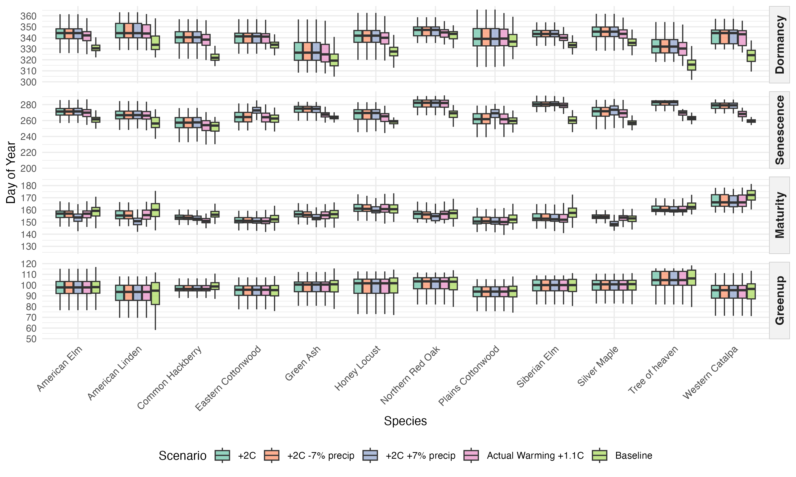

## Abstract

## 1. Introduction

Urban trees are among the most effective natural mitigators of the urban heat island (UHI) effect—a phenomenon in which urban regions consistently exhibit higher average temperatures than nearby rural areas. The UHI arises primarily from the prevalence of impervious surfaces, such as asphalt, concrete, and rooftops, which absorb and retain solar radiation and reduce nighttime cooling (Oke, 1982; EPA, 2023). These elevated temperatures exacerbate energy demand, degrade air quality, and increase heat-related health risks for urban residents (Stone, 2012). As global temperatures continue to rise and urbanization expands, the effects of UHIs are expected to intensify in the coming decades (Stone, 2012). By providing shade and facilitating evapotranspiration, trees can reduce surface and ambient air temperatures by several degrees. Studies have demonstrated that neighborhoods with mature tree canopy cover experience measurably cooler microclimates compared to areas with limited vegetation (Ziter et al., 2019; Alonzo et al., 2021). Given the increasingly critical role of urban forests in climate resilience strategies, it is essential to understand the drivers of urban tree phenology—the seasonal patterns of leaf emergence, growth, and senescence—and how these patterns may shift as environmental conditions change.

The timing and duration of these seasonal patterns are strongly influenced by climate, particularly temperature and precipitation. Elevated temperatures caused by anthropogenic climate change can lengthen the growing season of urban trees (Zhang et al., 2022; Yang et al., 2020). Higher spring temperatures typically accelerate leaf emergence, while warmer fall temperatures may delay leaf senescence, extending the period of active growth and canopy cover (Zhang et al., 2022; Zhou et al., 2020). This extended canopy period can enhance the cooling benefits of urban trees by increasing shade and evapotranspiration, helping to mitigate the urban heat island effect. However, these benefits are not guaranteed: warmer winters followed by late spring freezes can delay leaf-out, disrupt flowering, and reduce the expected benefits of extended growing seasons, particularly in species that leaf out early in spring (Chamberlain et al., 2021; Fu et al., 2024).

Precipitation patterns add another layer of complexity. Spring drought can delay leaf-out and flowering, while wet conditions may accelerate growth but increase vulnerability to disease and root stress. In the fall, low precipitation or drought stress can trigger earlier leaf senescence, shortening the period of active growth and reducing canopy cover (Cleland et al., 2007; Peñuelas et al., 2004; Li et al., 2019). Critically, the interaction of temperature and precipitation determines ultimate outcomes, as insufficient soil moisture can counteract the effects of warmer temperatures, underscoring the complex challenges that climate change poses for urban tree health and their role in mitigating urban heat.

Monitoring and predicting these phenological responses require appropriate observational tools. The body of research on urban phenology has evolved along multiple scales of observation. Coarse-scale studies often rely on remote sensing platforms such as MODIS, which provide high temporal but low spatial resolution data to monitor citywide phenological trends and seasonal canopy dynamics (Zhang et al., 2004; Melaas et al., 2016). At the opposite end of the spectrum, fine-scale studies use in-situ observations or near-surface imaging networks like PhenoCam to capture species-level variation and microclimate effects that are often obscured at broader scales (Richardson et al., 2018; Klosterman et al., 2018). More recently, high-resolution satellite constellations such as PlanetScope have emerged as a valuable intermediate approach, combining the spatial precision needed to monitor the location of individually identified trees with the temporal frequency required to monitor phenological changes at an almost daily bases (Bolton et al., 2020; Alonzo et al., 2020). Researchers can now study urban vegetation across large urban areas on an unprecedented detail and scale. This new approach also allows researchers to simulate and predict how different urban tree species may respond to future climate conditions, supporting proactive planning for urban resilience and heat mitigation.

### 1.1 Objectives

This study leverages near-daily PlanetScope NDVI observations of urban trees in Denver, Colorado, daily climate data from 2018 to 2024, and land cover data to investigate how urban tree phenology responds to environmental drivers and how these responses may shift under future climate scenarios. Specifically, this research addresses three key questions:

1.  Do species show differential phenological sensitivities to temperature versus precipitation drivers, and which climate variables most strongly influence the timing of greenup, maturity, senescence, and dormancy across twelve common Denver tree species?
2.  How does land cover—such as impervious surfaces versus irrigated landscapes—affect tree phenology?
3.  How will different tree species respond to moderate climate change scenarios?

### 1.2 Study Area

Denver, Colorado provides a compelling case study, as the city confronts both substantial warming and precipitation uncertainty that will directly affect urban tree phenology and the cooling services trees provide. Understanding these dynamics is critical not only for Denver but also for similarly positioned mid-latitude cities experiencing rapid warming and uncertain precipitation futures. According to Colorado State University's Colorado Climate Center's most recent Climate Change in Colorado report, by mid-century, Denver is projected to see temperatures rise between 1.4°C and 3.1°C compared to the 1971–2000 baseline. The city has already warmed by approximately 1.1°C over the past 30 years, with the most pronounced increases occurring during summer and fall. Under moderate emissions scenarios, Denver's climate will resemble that of Pueblo, Colorado today, whereas higher emissions scenarios could make it feel more like Albuquerque, New Mexico. Summer and fall are expected to warm slightly more than winter and spring, with summer temperatures increasing by 2.2–3.3°C and winter by 1.7–2.2°C. This warming is projected to drive dramatic increases in extreme heat events: by mid-century, Denver could experience an average of 7 days per year exceeding 37.8°C (100°F) and roughly 35 days above 35°C (95°F), compared to very few such days historically. In essence, the typical year in 2050 may be as warm as the hottest years on record today.

Future precipitation patterns for Denver remain highly uncertain, compounding the challenge for urban forest managers. Climate models (CMIP5 and CMIP6 under RCP 4.5 scenarios) disagree on whether precipitation will increase or decrease, with projections ranging from -7% to +7% by 2050. While northern Front Range projections, including Denver, are generally shifted toward wetter outcomes compared to southern Colorado, the consensus is weak outside of winter, when most models project an increase in precipitation. Overall, the share of precipitation falling during heavy downpours is expected to rise from about 46% to 50% by mid-century. Despite these potential increases, warmer temperatures may offset benefits by pulling more moisture from snowpacks, soils, and plants, compounding the risk of drought and reducing water availability. This risk is not hypothetical: Denver has already experienced persistent dry conditions in the 21st century, with four of the five driest years in the 128-year record occurring since 2000.

The study period of this paper (2018 to 2024), captures years with temperatures and precipitation both above and below the 1971-2000 baseline. Notably, 2024 was Denver's third warmest year on record, with temperatures 1.8°C above baseline—approximating mid-century projections—while 2019 and 2020 were notably drier than average. This climate variability enables us to model how Denver's urban trees respond to conditions projected for 2050.

## 2. Methods & Materials

This study models individual tree phenological metrics against corresponding land cover characteristics and seasonal climate variables using machine learning methods. We combined near-daily PlanetScope NDVI observations from 2018-2024 with Denver's municipal tree inventory, daily climate records, and high-resolution land cover data to create a comprehensive dataset linking individual tree phenology to environmental drivers. XGBoost models were fit separately for each species and phenological stage (greenup, maturity, senescence, dormancy) to quantify climate and land cover effects, with model predictions then used to simulate phenological responses under future climate scenarios.

### 2.1 Materials

#### 2.1.1 Denver Tree Inventory and Tree Sample Selection

The City and County of Denver's *Tree Inventory Denver* is a publicly available urban forestry database containing detailed records for approximately 300,000 trees across Denver County. The inventory includes species identification, tree size measurements, health assessments (disease and pest observations), and precise GPS coordinates for each tree. This comprehensive dataset enabled our remote sensing analysis by allowing us to link individual trees in the inventory to their corresponding locations in satellite imagery.

Our analysis focused exclusively on trees within Denver County boundaries west of longitude -104.7302°. This spatial filter excluded outlier trees that, while technically within county boundaries, exist in radically different environments such as prairie grasslands near the airport.

From this spatially filtered inventory, we implemented a four-part sampling approach to select trees suitable for satellite-based remote sensing phenology analysis. First, we restricted the sample to mature trees with diameters of 24 inches or greater, as larger trees have crown sizes more readily detectable in moderate-resolution satellite imagery. Second, we selected 15 species based on their abundance in the Denver urban forest, ensuring adequate sample sizes for species-specific modeling. Third, we prioritized species diversity by including both deciduous and coniferous species, representatives from multiple genera with intra-genus variation (e.g., multiple *Populus* species), and a mix of native and non-native species to capture variation in climate sensitivity and adaptation. Fourth, we considered average mature crown size for each species based on USDA Forest Service Urban Tree Database classifications to ensure trees would be adequately resolved in PlanetScope imagery (3-meter spatial resolution).

An interactive Shiny application was developed to facilitate sample selection and quality control, allowing visual inspection of candidate trees' spatial distribution across Denver County. The final sample consisted of 23,779 individual trees from 15 species representing 11 genera, including 11 native species, 2 non-native species, and 2 invasive species (Table 1).

\[Table 1: Summary of selected tree species with sample sizes and ecological characteristics\]

| Scientific Name | Common Name | Genus | Obs. | Status | Leaf Type |
|------------|------------|------------|------------|------------|------------|
| *Acer saccharinum* | Silver Maple | *Acer* | 6,217 | Native | Deciduous |
| *Ailanthus altissima* | Tree of Heaven | *Ailanthus* | 426 | Invasive | Deciduous |
| *Catalpa speciosa* | Western Catalpa | *Catalpa* | 656 | Native | Deciduous |
| *Celtis occidentalis* | Common Hackberry | *Celtis* | 656 | Native | Deciduous |
| *Fraxinus pennsylvanica* | Green Ash | *Fraxinus* | 2,369 | Native | Deciduous |
| *Gleditsia triacanthos* | Honey Locust | *Gleditsia* | 2,642 | Native | Deciduous |
| *Pinus nigra* | Austrian Pine | *Pinus* | 957 | Non-native | Conifer |
| *Pinus ponderosa* | Ponderosa Pine | *Pinus* | 521 | Native | Conifer |
| *Populus deltoides* | Eastern Cottonwood | *Populus* | 871 | Native | Deciduous |
| *Populus sargentii* | Plains Cottonwood | *Populus* | 1,070 | Native | Deciduous |
| *Quercus rubra* | Northern Red Oak | *Quercus* | 481 | Native | Deciduous |
| *Tilia americana* | American Linden | *Tilia* | 655 | Native | Deciduous |
| *Tilia cordata* | Littleleaf Linden | *Tilia* | 405 | Non-native | Deciduous |
| *Ulmus americana* | American Elm | *Ulmus* | 2,794 | Native | Deciduous |
| *Ulmus pumila* | Siberian Elm | *Ulmus* | 2,919 | Invasive | Deciduous |

#### 2.1.2 Remotely Sensed NDVI Data

The Normalized Difference Vegetation Index (NDVI) is a widely used spectral index that measures vegetation greenness by comparing the difference between near-infrared (strongly reflected by vegetation) and red light (absorbed by vegetation). This relationship emerges from plant physiology: chlorophyll in leaves strongly absorbs red light for photosynthesis, while the cellular structure of healthy leaves strongly reflects near-infrared radiation. The index ranges from -1 to +1, with higher values indicating greater photosynthetic activity and canopy density.

Since its development in the 1970s, NDVI has become one of the most widely applied metrics in vegetation remote sensing. It has been used to monitor crop health, assess drought impacts, track deforestation, and map global vegetation dynamics across scales from individual plants to entire biomes. For phenological applications specifically, NDVI provides a continuous, objective measure of canopy greenness that directly reflects the seasonal cycles of leaf emergence, maturation, and senescence.

The studies NDVI observations were obtained from PlanetScope's imagery in the red (590-670 nm) and near-infrared (780-860 nm) bands.

Because of the images fine resolution, multiple daily images had to be mosaicked togeather to create continuous spatial coverage over Denver County, with scene overlaps resolved by selecting the highest quality pixels based on image acquisition geometry and radiometric quality. Quality assessment layers provided by PlanetScope were used to mask clouds, snow, and haze, automatically detecting atmospheric interference that would compromise NDVI accuracy. NDVI was calculated for each masked image using the standard formula:

$$NDVI = (NIR - Red) / (NIR + Red)$$

Tree-level NDVI values were extracted by overlaying tree locations from the Denver inventory with NDVI imagery. For each tree, we created a circular buffer around the GPS coordinates sized to approximate the tree crown based on species-specific mature crown diameter estimates. To capture canopy pixels rather than understory or adjacent features, we filtered each tree-date observation to retain only the top 25% of NDVI values within the buffer, reducing contamination from grass, pavement, or other non-target features while maintaining sufficient sample size. These daily observations were compiled into NDVI time series for each tree spanning 2018-2024, creating a multi-year record of vegetation greenness dynamics at the individual tree level that served as the foundation for phenological curve fitting and metric extraction. Below is an example of the NDVI values extracted for an individual tree.


#### 2.1.3 Extracted Phenological Metrics

Phenological metrics were extracted from the raw NDVI time series using the `phenofit` package in R [@kong2022], which implements multiple curve-fitting methods and automated quality control procedures for vegetation phenology analysis. The extraction process involved several preprocessing steps, curve fitting procedures, and quality filters to ensure robust metric derivation. Raw NDVI values were first despiked to remove anomalous observations caused by residual cloud contamination, sensor noise, or atmospheric interference using a median-based despike filter with a 3-point window and 5 standard deviation threshold from the `oce` package [@kelley2022].

Individual growing seasons were identified from the NDVI time series using the `season_mov()` function with weighted Whittaker (wWHIT) smoothing [@eilers2003], which automatically detects seasonal boundaries by identifying local minima in smoothed NDVI curves. To improve the accuracy of growing season detection, particularly for trees exhibiting multi-year growth trends, NDVI time series were detrended using a linear model regressing NDVI against time. The fitted trend was removed while preserving the mean NDVI value, allowing the season detection algorithm to isolate seasonal phenological cycles from inter-annual growth patterns. While growing seasons generally corresponded to calendar years, the algorithm occasionally detected seasons spanning year boundaries, particularly for trees with extended dormancy periods or delayed spring greenup. For each detected growing season, we fitted phenological curves using the double-logistic Elmore function [@elmore2012], which models vegetation greenness as 

$$y(t) = c + (d - c) \left[\frac{1}{1 + e^{a_1(t - b_1)}} - \frac{1}{1 + e^{a_2(t - b_2)}}\right]$$

where $c$ is the baseline NDVI, $d$ is the peak NDVI, $(a_1, b_1)$ control spring greenup rate and timing, and $(a_2, b_2)$ control fall senescence rate and timing. The Elmore curve was selected after testing multiple curve types (double-logistic, asymmetric Gaussian, Beck) because it consistently produced the most reliable fits across species and provided biologically interpretable parameters for both greenup and senescence phases.

Curve fit quality was assessed using adjusted R², with trees retained in the final sample only if they met two criteria: (1) mean R² ≥ 0.90 across all fitted growing seasons, and (2) at least 6 growing seasons successfully detected over the 7-year study period. These conservative thresholds ensured high-quality phenological curves while excluding trees with poor NDVI signal due to crown damage, sensor artifacts, or persistent cloud cover. Four phenological stage dates were extracted from each annual curve using the inflection point method [@zhang2003], which identifies the dates of maximum rate of change in the NDVI trajectory: (1) **Greenup** - spring inflection point marking rapid leaf emergence, (2) **Maturity** - the date of peak NDVI when maximum canopy development is reached, (3) **Senescence** - fall inflection point marking rapid leaf loss, and (4) **Dormancy** - the date when NDVI reaches its winter minimum. Inflection points were chosen over alternative methods (e.g., threshold-based or derivative-based) because they are less sensitive to baseline NDVI variations and provide consistent timing estimates across species with different canopy densities. All extracted metrics, fitted curve parameters, goodness-of-fit statistics, and curve metadata were saved for each tree-year observation. A custom R function was developed to facilitate visualization of annual curves with overlaid phenological metrics, available at \[GitHub repository link\]. After quality filtering, 3,450 trees acrross 12 species remained from the initial sample of 23,779 trees, providing 24,150 tree-year observations across the 2018-2024 study period.

#### 2.1.4 Climate Data

Daily climate observations were obtained from the National Oceanic and Atmospheric Administration (NOAA) Global Historical Climatology Network-Daily (GHCN-Daily) database for station USW00023062, located within Denver Central Park (formerly Stapleton International Airport). This station was selected due to its central location within Denver County. Three core meteorological variables were extracted: maximum daily temperature (TMAX), minimum daily temperature (TMIN), and daily precipitation (PRCP). From these variables, Daily mean temperature was calculated as the arithmetic mean of TMAX and TMIN.

To align climate variables with the biological timing of phenological stages, daily observations were aggregated into seasonal summaries corresponding to key periods of tree development. Temperature metrics included both seasonal mean temperatures and seasonal mean maximum temperatures, capturing both average thermal conditions and peak daytime heat stress. Precipitation was summarized in two ways: seasonal totals (e.g., spring precipitation sum) to capture resource availability during active growth periods, and year-to-date cumulative totals to represent antecedent moisture conditions that influence phenological timing through soil water storage. These seasonal windows were defined to capture climate conditions during biologically relevant periods preceding or coinciding with each phenological stage. For example, greenup timing was modeled using late winter and early spring climate (February-April), while senescence timing incorporated summer and early fall conditions (June-October).

The resulting climate dataset included 10 distinct seasonal periods (winter, late winter, spring, early spring, late spring, summer, late summer, fall, early fall, late fall) with corresponding temperature and precipitation metrics. This temporal structure was designed to maximize consistency across phenological stages while preserving sufficient climate variation to detect species-specific sensitivities to temperature versus precipitation drivers. Table \[##\] provides a complete breakdown of seasonal climate variables, their corresponding months, and which phenological were selected as predictors for modeling.

**Table X: Climate Variable Definitions and Seasonal Aggregations**

| Seasonal Period | Months | Climate Metrics | Rationale |
|------------------|------------------|-------------------|------------------|
| **Winter** | Dec-Jan-Feb\* | Mean temp, Mean Tmax, Total precip, Precip days | Winter chilling requirements and moisture storage |
| **Late Winter** | Feb-Mar | Mean temp^G^, Mean Tmax^G^, Total precip^G^, Precip days^G^, YTD cumulative precip | Transition to spring; pre-greenup conditions |
| **Spring** | Mar-Apr-May | Mean temp, Mean Tmax, Total precip^M^, Precip days, YTD cumulative precip | Primary growing season onset |
| **Early Spring** | Mar-Apr | Mean temp, Mean Tmax, Total precip, Precip days, YTD cumulative precip | Critical leaf-out period |
| **Late Spring** | May-Jun | Mean temp^M^, Mean Tmax^M^, Total precip, Precip days^M^, YTD cumulative precip | Canopy development and peak growth |
| **Summer** | Jun-Jul-Aug | Mean temp, Mean Tmax, Total precip, Precip days, YTD cumulative precip | Peak growing season and heat stress |
| **Late Summer** | Jul-Aug | Mean temp, Mean Tmax, Total precip^S^, Precip days^S^, YTD cumulative precip | Transition to dormancy preparation |
| **Fall** | Sep-Oct-Nov | Mean temp, Mean Tmax^D^, Total precip, Precip days^D^, YTD cumulative precip^D^ | Leaf senescence period |
| **Early Fall** | Sep-Oct | Mean temp^S^, Mean Tmax^S^, Total precip, Precip days, YTD cumulative precip | Primary leaf color change and drop |
| **Late Fall** | Nov-Dec | Mean temp^D^, Mean Tmax, Total precip, Precip days, YTD cumulative precip | Final leaf drop and winter preparation |

\* December values assigned to following year to maintain biological relevance\
^G^ Used in Greenup models \| ^M^ Used in Maturity models \| ^S^ Used in Senescence models \| ^D^ Used in Dormancy models

**Note:** All models also included land cover variables (impervious surface, irrigated surface, unirrigated surface, tree canopy, and water at 90m buffer) which are detailed in Section 2.1.5.

#### 2.1.5 Landcover Data

Land cover characteristics surrounding each tree were derived from the City and County of Denver's high-resolution land cover dataset, which provides 1-meter spatial resolution classification of the urban landscape. This dataset classifies the region into nine distinct land cover categories: (1) structures, (2) impervious surfaces, (3) water, (4) grassland/prairie, (5) tree canopy, (6) irrigated lands/turf, (7) barren/rock, (8) cropland, and (9) shrubland/scrubland. The fine spatial resolution of this dataset allows for precise characterization of the immediate environment surrounding individual trees, capturing the heterogeneity of urban landscapes that influences tree microclimate and resource availability.

To quantify local land cover context for each tree, circular buffers of 90 meters were created around each tree's GPS coordinates. These buffer sizes were selected to capture both immediate microsite conditions on tree phenology. Within each buffer, the number of pixels belonging to each land cover class was tallied and converted to percentages, representing the proportion of the surrounding landscape occupied by each cover type. Following methodology similar to Crawford et al. [@crawford2016], the nine original land cover classes were consolidated into five ecologically meaningful categories to simplify interpretation and reduce model complexity (Table X). The 90-meter buffer land cover variables were used as predictors in all XGBoost models to account for local environmental context effects on phenological timing.

**Table X: Land Cover Classification Consolidation**

| Final Category          | Original Classes Included                    |
|-------------------------|----------------------------------------------|
| **Impervious Surface**  | Structures, Impervious Surfaces, Barren/Rock |
| **Irrigated Surface**   | Cropland, Irrigated Lands/Turf               |
| **Unirrigated Surface** | Grassland/Prairie, Shrubland/Scrubland       |
| **Tree Canopy**         | Tree Canopy                                  |
| **Water**               | Water                                        |

### 2.2 Methedologies

#### 2.2.1 Pearson Correlation Analysis

Prior to formal modeling, we conducted exploratory correlation analysis to assess the strength and direction of relationships between climate variables and phenological metrics across species. We calculated Pearson correlation coefficients between each phenological metric and its biologically relevant climate predictors using pairwise complete observations to handle missing data. This approach allowed us to examine preliminary patterns while accommodating the unbalanced nature of our dataset.

For each species, we computed correlations between four phenological metrics (green-up, maturity, senescence, and dormancy) and their corresponding climate variables selected based on seasonal relevance. This dual approach allowed us to assess both the consistency of climate effects across species and the degree of species-specific variation in climate sensitivity. Results are visualized as a heatmap (figure ##) showing individual species correlations alongside the cross-species average.

#### 2.2.2 Extreme Gradient Boosted Model

We used XGBoost (Extreme Gradient Boosting) to model the relationship between environmental predictors and phenological timing for each tree species. XGBoost is a machine learning algorithm that builds an ensemble of decision trees sequentially, where each new tree learns to correct the errors of previous trees. Unlike traditional parametric models, XGBoost makes no distributional assumptions about residuals and can automatically capture non-linear relationships and complex interactions between predictors. Individual models were fitted for all four of the phenological metrics for each of the 12 species (48 models in total).

For each if model, XGBoost learns a function where:

$$Y = f(X_1, X_2, ..., X_k)$$

with $Y$ representing the phenological metric (day of year), $X_1...X_k$ representing environmental predictors (climate and land cover variables), and tree features capturing individual tree characteristics. The function $f()$ is learned through an ensemble of regression trees, with each tree making sequential improvements to minimize prediction error.

Each model included two categories of features. First, we incorporated environmental predictors specific to each phonological stage, including 3 climate variables (seasonally relevant temperature mean, mean max temperature and precipitation either year-to-date cumulative or cumulative within a given season) and land cover variables (percent impervious surface and percent of irrigated surfaces). Climate variables captured regional meteorological conditions and year-to-year variation, while land cover variables represented local environmental context including urban heat island effects, altered water availability, and differences in solar radiation exposure. When both temperature and precipitation variables were included for a phenological stage, we also created an interaction term (temperature × precipitation) to allow the model to capture synergistic or antagonistic effects between these climate drivers. For instance, the phenological response to warm temperatures may differ under wet versus dry conditions. Below is a breakdown of the climate and land cover variables used to models each of the phonological metrics.

Second, we included tree-specific features to account for repeated measures on individual trees, analogous to random effects in mixed models. These features included tree_mean_pheno (historical average phenology timing for each tree), tree_n_obs (number of observation years per tree), and UID_numeric (numeric tree identifier). These tree-specific features allow the model to capture consistent early or late timing in individual trees due to genetics, tree health, or fine-scale microsite conditions, while environmental predictors capture spatial and temporal variation.

We used conservative hyperparameters optimized for regularization and generalization. The ensemble consisted of 500 trees (nrounds), with each tree having a maximum depth of 4 levels (max_depth) to prevent overfitting. The learning rate (eta) was set to 0.01, a relatively low value that requires more iterations but produces more stable and accurate models. To introduce beneficial randomness that improves generalization, we set subsample to 0.7 (using 70% of observations for each tree) and colsample_bytree to 0.7 (using 70% of features for each tree). The objective function was set to reg:squarederror for squared error loss appropriate for continuous outcomes. These conservative parameters prioritize prediction accuracy and model stability over training speed.

We evaluated model performance using 10-fold cross-validation with a fixed random seed (123) for reproducibility. Data were randomly partitioned into 10 groups, with models iteratively trained on 90% of data and tested on the remaining 10%. This procedure was repeated across all folds to produce out-of-sample predictions for the entire dataset. We calculated four performance metrics: cross-validated R² (variance explained), root mean squared error (RMSE, in days), and mean absolute error (MAE, in days).

Our models achieved RMSE values ranging from 5.9 to 12.9 days across all 48 species-stage combinations. These error magnitudes are approximately 2-3 times higher than RMSE values (2.1 to 4.9 days) reported by \[Author et al., 2019\] using gradient boosting for the prediction of tree phenology metrics (spring leaf-out). The significant difference could be attributed to differences in data sources used to derive the phenological metrics. \[Author et al., 2019\] modeled spring leaf-out dates from ground-based visual observations at individual sites over a 20 to 30 year period, instead of remote sensing data collected over a 7 year period. Given the limitations of our data a our gradient boosting models are preforming within an exceptionable margain of error and are effectively capture climate-phenology relationships.

**Table X: XGBoost Model Performance by Phenological Stage**

| Phenological Stage | N Species | Total Obs. | Mean R² | Mean RMSE (days) |
|--------------------|-----------|------------|---------|------------------|
| Maturity           | 12        | 2,244      | 0.644   | 6.95             |
| Green-up           | 12        | 2,194      | 0.644   | 8.29             |
| Senescence         | 12        | 2,182      | 0.691   | 9.10             |
| Dormancy           | 12        | 2,158      | 0.590   | 11.64            |

A breakdown of average performance across the 12 species for each of the four phenological stages can be found in Table \[##\]. A complete breakdown of performance across all 48 individual species-stage models can be found in Appendix \[##\].

All analyses were conducted in R version 4.x using the xgboost, lme4, mgcv, caret, and tidyverse packages.

#### 2.2.3 Linear Mixed Models: Comparison and Limitations

We initially attempted to model climate-phenology relationships using linear mixed-effects models (LMMs), which are standard in phenological research due to their interpretability. LMMs were specified as

$$Y_{ij} = \beta_0 + \beta_1X_{1ij} + \beta_2X_{2ij} + u_i + \varepsilon_{ij}$$ 

where $Y_{ij}$ is phenology timing for tree $i$ in year $j$, $X_1$ and $X_2$ are climate predictors, $\beta_0$-$\beta_2$ are fixed effect coefficients, $u_i$ is a random intercept for each tree, and $\varepsilon_{ij}$ is residual error.

However, diagnostic tests revealed severe assumption violations across 97% of models (69/72). Only 2.8% (2/72) passed tests for normality, homoscedasticity, and random effect normality. The mean proportion of outliers ($|\text{standardized residual}| > 3$) was X.X%, approximately 2-3× higher than expected under perfect normality. Visual diagnostics showed heavy-tailed residual distributions and heteroscedasticity, raising concerns about the reliability of standard errors and coefficient estimates despite large sample sizes (336-5,359 observations per model).

While large sample sizes and cross-validation suggested LMMs remained reasonable approximations, the pervasive assumption violations raised concerns about parameter estimate reliability and standard error accuracy. We tested Generalized Additive Mixed Models (GAMMs) as an alternative that relaxes normality assumptions, but GAMMs either performed worse than MMs or failed to converge due to limited basis dimension relative to the number of trees. These limitations motivated our adoption of XGBoost as the primary modeling framework.

## 3. Results

### 3.1 Species-Specific Climate Sensitivities

#### 3.1.1 Climate-Phenology Correlations

Pearson correlation analysis revealed distinct patterns of climate sensitivity across phenological stages and species. Temperature and precipitation exert differential influence depending on the seasonal timing of each phenological transition.

Although the relationship between climate metrics and greenup timing is weaker than the other three phenological stages, across all species, greenup timing seemed to be driven most notably by late winter climate conditions, as all three late winter precipitation metrics show the strongest negative correlations with greenup timing. This suggests that wetter late winter conditions advance spring leaf emergence, having a greater effect than temperature during this period. Notably, the American Elm, Siberian Elm and Silver Maple exhibited slightly stronger sensitivity to late winter precipitation compared to most other species. This may suggest that these genera may be particularly responsive to early spring moisture availability. 

Maturity timing demonstrated the strongest and most consistent climate sensitivities of any phenological stage. Spring temperature variables showed uniformly strong negative correlations across all species, indicating that warmer spring conditions substantially accelerate the transition to peak canopy development. Tree of Heaven, Western Catalpa, and Common Hackberry exhibited particularly pronounced temperature sensitivity. In contrast, precipitation displayed more variable patterns across species, with some showing positive associations and others showing near-zero or slightly negative correlations. The consistency of temperature effects across all species suggests that thermal conditions are the primary driver of maturity timing, while moisture availability plays a secondary and species-specific role.


Senescence timing seems to be driven by both temperature and precipitation. Late summer maximum and mean temperature showed negative correlations across species, indicating that extreme summer heat accelerates the onset of senescence. American Lindens, Northern Red Oaks, and Siberian Elms seem to be particularly susceptible to summertime heat. In contrast, early fall temperature and late summer precipitation both showed strong positive correlations, with warmer autumn conditions and increased moisture delaying leaf color change and senescence. This suggests a dual-phase control: summer heat stress may trigger early senescence as a protective response, while favorable autumn conditions (warmth and moisture) extend the active growing season by delaying the physiological cues for leaf abscission. While temperature effects showed relatively uniform responses across species, precipitation sensitivity varied. Cottonwoods appear to be less sensitive to late-summer and early fall precipitation, possibly indicating drought tolerance.

Dormancy timing showed weaker and less consistent climate associations than earlier phenological stages. Fall precipitation metrics displayed predominantly negative correlations, suggesting that frequent autumn precipitation delays dormancy. Fall temperature showed positive but more modest correlations, indicating that warmer conditions delay dormancy. However, substantial variation in correlation strength across species existed for both temperature and precipitation variables. Siberian Elm phenology seemed to be particularly influenced by fall climate conditions, whereas Cottonwoods showed minimal climate sensitivity to fall and late fall conditions.

Comparing across all phenological stages, native tree species such as Common Hackberry and Western Catalpa, as well as invasive species Siberian Elm and Tree of Heaven, showed the highest degree of climate sensitivity, with overall absolute mean correlations exceeding. In contrast, native species Eastern and Plains Cottonwoods showed relatively low climate sensitivity across all seasons, with overall absolute mean correlations below. High climate sensitivity did not align strictly with native versus invasive status, as both groups included highly sensitive species.

#### 3.1.2 Modeled Climate Responses Using Partial Dependence Analysis

While Pearson correlations provide valuable insights into bivariate climate-phenology relationships, they do not account for interactions among climate variables or control for confounding factors such as land cover and tree-level characteristics. To address these limitations, we used partial dependence analysis from the XGBoost models to examine how phenological timing responds to individual climate drivers while holding all other predictors constant at their mean values. This approach offers a more robust assessment of climate effects by isolating the marginal influence of each climate variable within the multivariate context of the full model. Partial dependence plots reveal the shape of these relationships—including potential non-linearities and thresholds—and allow for direct comparison of climate sensitivities across species while accounting for the complex interactions between temperature, precipitation, and local environmental conditions that simultaneously influence phenological timing.


### 3.2 Land Cover Effects on Phenology

-   Model results showing impervious vs irrigated surface effects
-   Species-specific differences in land cover sensitivity
-   Magnitude of land cover effects relative to climate effects

### 3.3 Future Climate Scenario Projections



-   Phenological shifts under moderate scenarios
-   Species showing largest shifts
-   Direction of changes (earlier greenup, delayed senescence, etc.)

## 4 Discussion

### 4.1 Climate Sensitivity Patterns

-   Interpret species temperature vs precipitation sensitivity
-   Connect to species ecology/functional traits
-   Compare to literature

### 4.2 Land cover effects

-   Importance of land cover effects for urban forestry
-   Implications for tree placement strategies
-   Irrigation vs natural precipitation patterns

### 4.3 Future Climate Implications

-   Species "winners" vs "losers" under warming
-   Growing season extension and cooling benefits
-   Risk of phenological mismatches or stress

## 5. Conclusion

## 6. Sources

## 7. Appendix

```{r}

#| label: tbl-importance
#| tbl-cap: "XGBoost Feature Importance (Gain) by Species and Phenological Stage"
#| echo: false

library(tidyverse)
library(kableExtra)

importance_data <- read_csv("../modeling/xgb_importance.csv")
n_cols <- ncol(importance_data)

importance_data %>%
  select(phenology, species, everything()) %>%
  mutate(across(everything(), ~replace_na(as.character(.), "-"))) %>%
  arrange(factor(phenology, levels = c("Greenup_doy", "Maturity_doy", "Senescence_doy", "Dormancy_doy"))) %>%
  knitr::kable(format = "latex", booktabs = TRUE, align = c("l", "l", rep("c", n_cols - 2))) %>%
  kable_styling(font_size = 8, latex_options = c("scale_down")) %>%  # scale_down fits to page
  column_spec(1:2, bold = TRUE, width = "3cm") %>%
  column_spec(3:n_cols, width = "0.8cm") %>%  # Narrow columns for features
  collapse_rows(columns = 1, valign = "top", latex_hline = "major") %>%
  row_spec(0, angle = 45) %>% 
  landscape()

```

```{r}
#| label: tbl-climate-scenarios
#| tbl-cap: "Phenological timing (day of year) and changes (Δ) for 12 tree species under climate warming scenarios"
#| echo: false

library(kableExtra)
library(tidyverse)

climate_data <- read_csv("../modeling/summary_table_climate_senarios") %>% 
  mutate(phenology = factor(phenology, 
                            levels = c("Greenup_doy", "Maturity_doy", 
                                      "Senescence_doy", "Dormancy_doy"),
                            labels = c("Greenup", "Maturity", 
                                      "Senescence", "Dormancy"))) %>%
  arrange(species, phenology) %>%
  # Round numeric columns
  mutate(across(where(is.numeric), ~round(.x, 2))) %>%
  # Format p-values
  mutate(across(contains("p_value"), ~ifelse(.x < 0.001, "<0.001", 
                                              sprintf("%.3f", .x)))) %>%
  # Create grouping column for species
  group_by(species) %>%
  mutate(species_label = ifelse(row_number() == 1, species, "")) %>%
  ungroup() %>%
  select(species_label, phenology, baseline_1970to2000,
         mean_warming_1.1C, mean_diff_1.1C, p_value_1.1C,
         mean_warming_2C, mean_diff_2C, p_value_2C,
         mean_warming_2C_dry, mean_diff_2C_dry, p_value_2C_dry,
         mean_warming_2C_wet, mean_diff_2C_wet, p_value_2C_wet)

# Create table
climate_data %>%
  kbl(
    col.names = c("Species", "Phenology", "Baseline",
                  "Mean", "Δ", "p",
                  "Mean", "Δ", "p",
                  "Mean", "Δ", "p",
                  "Mean", "Δ", "p"),
    align = c("l", "l", "r", rep("r", 12)),
    booktabs = TRUE,
    linesep = c("", "", "", "\\addlinespace")
  ) %>%
  kable_styling(
    font_size = 9,
    latex_options = c("scale_down", "HOLD_position")
  ) %>%
  add_header_above(c(" " = 3, 
                     "+1.1°C" = 3, 
                     "+2°C" = 3, 
                     "+2°C Dry" = 3, 
                     "+2°C Wet" = 3),
                   bold = TRUE) %>%
  column_spec(1, bold = TRUE, width = "3cm") %>%
  column_spec(2, width = "2.5cm")

```
